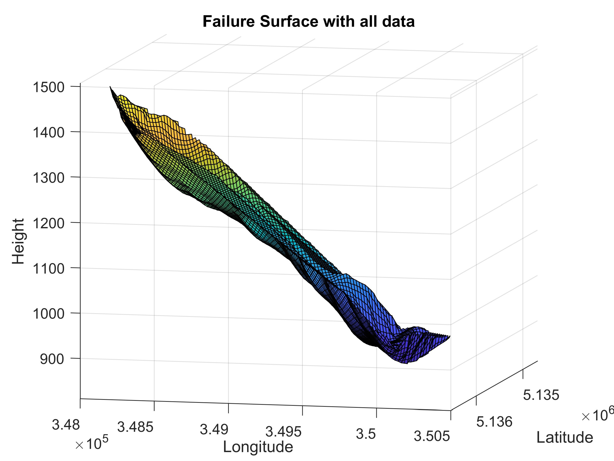
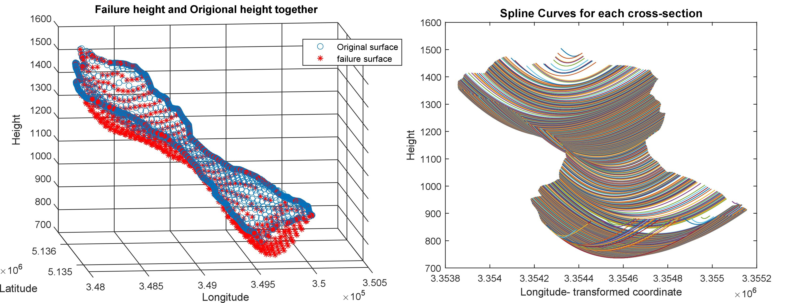

# Failure_surface_estimator

[](https://doi.org/10.1007/s10346-022-01940-5)

## Method to estimate the initial landslide failure surface and volumes using grid points and spline curves in MATLAB

Failure_surface_estimator is a new method to estimate the initial landslide failure surface and volumes using grid points and spline curves in `MATLAB`. The data inputs and the `MATLAB` codes and functions are discribed in the main code as instructions while running, to complete all the steps.profles. The model will give the depth of the probable failure surface plotted using the 2D grid function.

We can easily visualize the results by running the codes; the display will show the step-by-step processes involved.The user needs to have the `MATLAB` Mapping Toolbox (`MATLAB 2021`) installed as an extension to run the code.This is compatible with organizing geographic data and allows for the interpolation, trimming, resampling, and transformation of coordinates.

There are many functions required to compile the codes together to get the results. For smooth running, better to put all the functions and data at same location, the structure of files should be like this:

```
Folder:.
│  deg2utm.m
│  gridfit.m
│  kml2struct.m
│  LICENSE
│  Main_code.m
│  Main_code.mlx
│  poly3n.m
│  README.md
│  spline_param_new.m
│  utm2deg.m
│
├─Example_Frasse_Landslide
│      Frasse_Landslide_boundary.kml
│      Frasse_Landslide_data.tif
│
└─Example_Kotropi_Landslide
        kotropi_Landslide_boundary.kml
        kotropi_Landslide_data.tif
```

| **File Name**                  | **Size** | **Description**                                                                        |
| ------------------------------ | -------- | -------------------------------------------------------------------------------------- |
| deg2utm.m                      | 4KB      | Function to convert lat/lon vectors into UTM coordinates (WGS84)                       |
| Frasse_Landslide_boundary.kml  | 11KB     | Example of La frasse landslide containing the `.kml` file of landslide boundary          |
| Frasse_Landslide_data.tif      | 35KB     | Example of La frasse landslide containing the grid data in `.tiff` file formate boundary |
| gridfit.m                      | 35KB     | Function for surface fitting from scattered data                                       |
| kml2struct.m                   | 3KB      | Function to import a `.kml` file as a series of shapefile structs                      |
| kotropi_Landslide_boundary.kml | 4KB      | Example of Kotropi landslide containing the `.kml` file of landslide boundary            |
| kotropi_Landslide_data.tif     | 35KB     | Example of Kotropi landslide containing the grid data in `.tiff` file formate boundary   |
| Main_code.m                    | 42KB     | The main code to execute all the task for getting the results                          |
| Main_Code.mlx                  | 3,556KB  | The main code in `.mlx` formate for visualising the results step by step               |
| poly3n.m                       | 1KB      | Function used during spline curve                                                      |
| spline_param_new.m             | 1KB      | Fuction to store the values for the parameters of spline curve                         |
| utm2deg.m                      | 1KB      | Function to convert vectors of UTM coordinates into Lat/Lon vectors                    |

## Data required
The following data are required:

1. `KML` file of the contour lines tracing the boundary of the failure surface

2. `DEM` of the area in `TIFF` format covering the contour limits

## Quick Start

Open `MATLAB`, select the `Main_code.m` script, run the script and visualise the results as `MATLAB` figures and read the valuse from  commond window. For visualising the results step by step, select the `main_code.mlx` script and run it. You will see the outputs on the right side. 

## Results

---

<div align=center>
    
<div>

Fig. 1 3D mesh of the failure
surface and original surface
together with all the available
data

<br>


Fig. 2 a) Failure height and original height calculated using the spline; b) spline curves of the La Frasse Landslide.


## Compatibility

Failure_surface_estimetor is designed under a `MATLAB` architecture. However, it can also be run with `OCTAVE`. We did not check the compatibility of the estimetor with every version of `MATLAB` nor `OCTAVE`, but we provide a non-exhaustive list of compatibility.

`MATLAB` version:R2020b,R2020a, R2018b, R2018a, R2017b, R2016a, R2013b

`OCTAVE` version: 5.1.0.0

## Funding

Open access funding provided by University of Lausanne - Switzerland.

Additionally, if you are interested in our paper, please consider citing:

```bibtex
@article{Prajapati2022,
author = "Prajapati, Gautam and Jaboyedoff, Michel",
title = "Method to estimate the initial landslide failure surface and volumes using grid points and spline curves in MATLAB",
journal = "Landslides",
year = "2022",
month = "Aug",
day = "16",
issn = "1612-5118",
doi = "10.1007/s10346-022-01940-5",
url = "https://doi.org/10.1007/s10346-022-01940-5"
}
```

> 📧 Contact: gautam@es.iitr.ac.in
